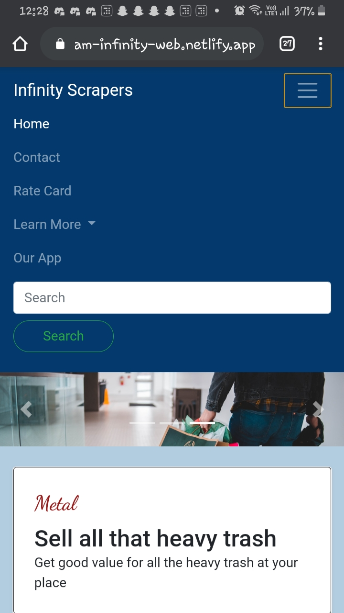
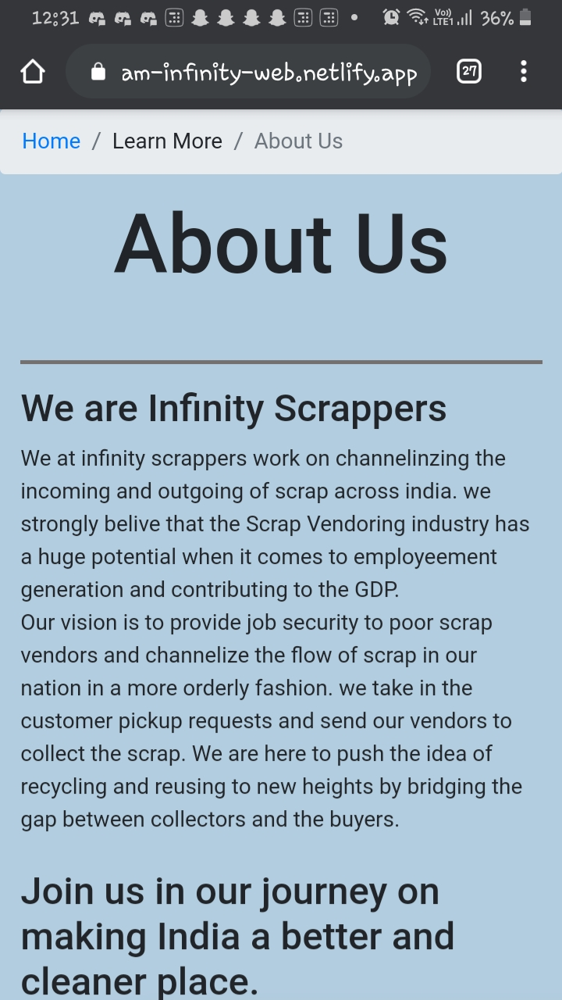
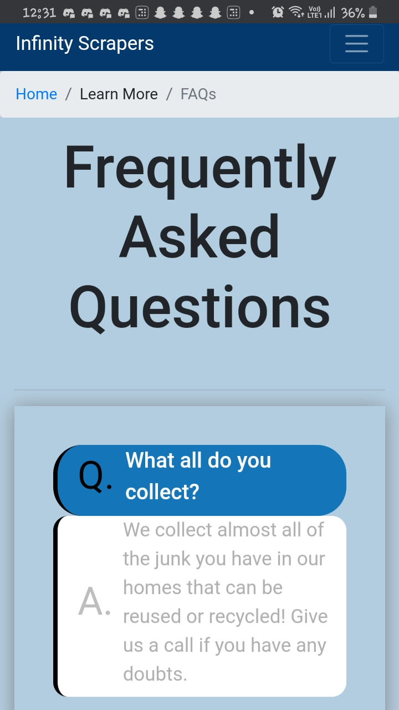
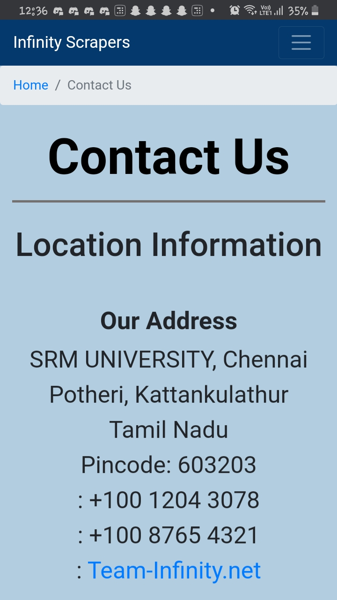
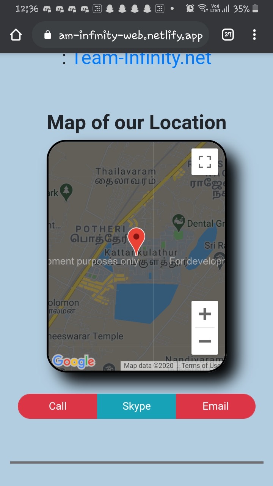

## Team Infinity's Official Hackathon Project

### Sustaining Lives🌲 Through Technology 💻

We have created a digital-platform which helps people connect with the scrap workers 🔗. Our main aim is to organise the self-employed scrap-workers under one umbrella organisation. This will ensure their job-security and also help them connect with more customers easily through our platform. We offer scrap pick-up-at-doorstep facility which will help the customers to arrange for a pick-up according to their timing preference and comfort📞. The bigger scenario is to make use of discarded items as much as possible and do our part in the GO GREEN Mission ♻✅

Here is a preview of our Mobile-view for our amazing platform!

                     

                     

                 

Here is a preview of our web-app through which customers will send pick-up requests!

          
